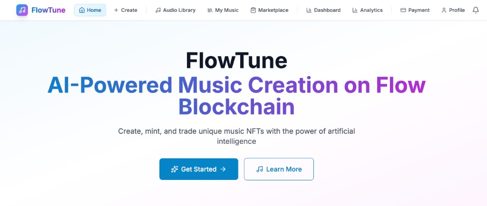

<div align="center">

# FlowTune 🎵
**AI-Powered Music Creation on Flow Blockchain**



**Language / 语言**

[](#english-version)
[](#中文版本)

</div>

---

## English Version

**FlowTune** is a decentralized music NFT platform built on the Flow blockchain, empowering music creators to mint, trade, and manage their music NFTs with the power of artificial intelligence.

### 🚀 Quick Deploy to Production

#### Option 1: Railway One-Click Deploy (Recommended)
```bash
./deploy-railway.sh
```

#### Option 2: Vercel Deploy
[](https://vercel.com/new/clone?repository-url=https://github.com/mbdtf202-cyber/FlowTune)

#### Option 3: Render Deploy
[](https://render.com/deploy)

#### Option 4: Docker Local Deploy
```bash
# Docker Desktop required
./deploy-production.sh
```

### 📖 Documentation

#### Deployment Guide
See [DEPLOYMENT_GUIDE.md](./DEPLOYMENT_GUIDE.md) for complete deployment instructions, including:
- Local Docker deployment
- Cloud platform deployment (Railway, Render, DigitalOcean, VPS)
- Environment variable configuration
- Troubleshooting

#### Complete Documentation
- 📚 [User Guide](./docs/USER_GUIDE.md) - Platform usage and feature introduction
- 🔧 [Developer Guide](./docs/DEVELOPER_GUIDE.md) - Technical architecture and development guide
- 🔒 [Security Implementation Report](./docs/API_SECURITY_IMPLEMENTATION.md) - Security measures and protection strategies
- 📋 [API Documentation](./docs/API_DOCUMENTATION.md) - Complete API interface documentation
- 🎬 [Demo Video Script](./docs/DEMO_VIDEO_SCRIPT.md) - Product demonstration script
- 🛡️ [Security Audit Report](./docs/SECURITY_AUDIT_REPORT.md) - Security assessment report

### 🔧 Environment Configuration

Before deployment, prepare the following API keys:
- **OpenAI API Key**: For AI music generation
- **Replicate API Token**: For music model inference
- **Pinata API Keys**: For IPFS storage
- **Flow Blockchain Config**: For NFT minting (optional)

### 🎭 Demo Data

The project includes complete demo data:
- **4 Demo Users**: AI Composer, Melody Master, Beat Creator, Synth Wave
- **5 Demo NFTs**: Covering different music styles and price ranges
- **Complete Market Data**: Including sales history, statistics, etc.

#### Run Demo Data Seed Script
```bash
cd backend
node scripts/seedDemoData.js
```

#### Demo User Login Information
- **Username**: ai_composer | **Email**: composer@flowtune.demo | **Password**: DemoPass123
- **Username**: melody_master | **Email**: melody@flowtune.demo | **Password**: DemoPass123
- **Username**: beat_creator | **Email**: beats@flowtune.demo | **Password**: DemoPass123
- **Username**: synth_wave | **Email**: synth@flowtune.demo | **Password**: DemoPass123

### 🌐 Access URLs

After deployment, your application will be available at:
- **Railway**: `https://your-app.railway.app`
- **Vercel**: `https://your-app.vercel.app`
- **Render**: `https://your-app.onrender.com`
- **Local**: `http://localhost`

### ✨ Features

- 🎵 **Music NFT Minting**: Support for audio file upload and NFT minting
- 🔐 **Flow Wallet Integration**: Support for Blocto, Dapper and other mainstream wallets
- 🎨 **Modern UI**: Responsive design with dark mode support
- 🛡️ **Security Protection**: Complete security policies and permission management
- 📊 **Real-time Monitoring**: Integrated performance monitoring and error tracking
- 🚀 **Automated Deployment**: Complete CI/CD pipeline

### 🏗️ Tech Stack

#### Frontend
- **React 18** - Modern frontend framework
- **React Router** - Client-side routing
- **Tailwind CSS** - Utility-first CSS framework
- **Vite** - Fast build tool
- **FCL (Flow Client Library)** - Flow blockchain integration

#### Backend
- **Node.js** - JavaScript runtime
- **Express.js** - Web application framework
- **MongoDB** - NoSQL database
- **Redis** - In-memory data structure store
- **JWT** - JSON Web Token authentication

#### Blockchain
- **Flow Blockchain** - NFT smart contracts
- **Cadence** - Smart contract language
- **IPFS** - Decentralized file storage

#### DevOps
- **Docker** - Containerization
- **GitHub Actions** - CI/CD automation
- **Nginx** - Web server and reverse proxy
- **Prometheus & Grafana** - Monitoring and analytics

### 🚀 Quick Start

#### Prerequisites
- Node.js 18+ and npm
- Docker and Docker Compose
- Git

#### Local Development
1. **Clone the repository**
   ```bash
   git clone https://github.com/mbdtf202-cyber/FlowTune.git
   cd FlowTune
   ```

2. **Install dependencies**
   ```bash
   # Install root dependencies
   npm install
   
   # Install frontend dependencies
   cd frontend && npm install && cd ..
   
   # Install backend dependencies
   cd backend && npm install && cd ..
   ```

3. **Configure environment variables**
   ```bash
   # Copy environment templates
   cp .env.example .env
   cp backend/.env.example backend/.env
   cp frontend/.env.example frontend/.env
   ```

4. **Start databases**
   ```bash
   # Start MongoDB and Redis
   docker-compose up -d mongodb redis
   ```

5. **Run database migrations**
   ```bash
   cd backend
   npm run migrate
   ```

6. **Start development servers**
   ```bash
   # Terminal 1: Start backend
   cd backend && npm start
   
   # Terminal 2: Start frontend
   cd frontend && npm run dev
   
   # Terminal 3: Start Flow emulator (optional)
   flow emulator start
   ```

#### Docker Deployment
```bash
# Production deployment
docker-compose -f docker-compose.prod.yml up -d

# Development deployment
docker-compose up -d
```

### 📁 Project Structure

```
FlowTune/
├── frontend/          # React frontend application
├── backend/           # Node.js backend API
├── cadence/           # Flow smart contracts
├── docs/              # Documentation
├── scripts/           # Deployment and utility scripts
├── config/            # Configuration files
└── docker-compose.yml # Docker services configuration
```

### 🔒 Security

- **Authentication**: JWT-based user authentication
- **Authorization**: Role-based access control
- **Data Validation**: Input sanitization and validation
- **Rate Limiting**: API rate limiting protection
- **CORS**: Cross-origin resource sharing configuration
- **HTTPS**: SSL/TLS encryption in production

### 🧪 Testing

```bash
# Run frontend tests
cd frontend && npm test

# Run backend tests
cd backend && npm test

# Run end-to-end tests
npm run test:e2e
```

### 📊 Monitoring

- **Application Monitoring**: Real-time performance metrics
- **Error Tracking**: Automated error reporting and alerting
- **Database Monitoring**: MongoDB and Redis performance tracking
- **System Health**: Infrastructure monitoring and alerting

### 🤝 Contributing

We welcome contributions! Please see our [Contributing Guide](./CONTRIBUTING.md) for details.

#### Development Workflow
1. Fork the repository
2. Create a feature branch
3. Make your changes
4. Add tests
5. Submit a pull request

### 📄 License

This project is licensed under the MIT License - see the [LICENSE](./LICENSE) file for details.

### 🌟 Acknowledgments

- Flow Blockchain team for the excellent blockchain platform
- React and Node.js communities for the amazing frameworks
- All contributors who helped make this project possible

### 📞 Contact

- **Project Repository**: https://github.com/mbdtf202-cyber/FlowTune
- **Live Demo**: https://flowtune-8jri4nnz0-mbdtf202-cybers-projects.vercel.app
- **Issues**: https://github.com/mbdtf202-cyber/FlowTune/issues

---

## 中文版本

**FlowTune** 是一个基于 Flow 区块链的去中心化音乐 NFT 平台，让音乐创作者能够通过人工智能的力量铸造、交易和管理他们的音乐作品 NFT。

### 🚀 快速部署到公网

#### 选项1: Railway 一键部署（推荐）
```bash
./deploy-railway.sh
```

#### 选项2: Vercel 部署
[](https://vercel.com/new/clone?repository-url=https://github.com/mbdtf202-cyber/FlowTune)

#### 选项3: Render 部署
[](https://render.com/deploy)

#### 选项4: Docker 本地部署
```bash
# 需要先安装Docker Desktop
./deploy-production.sh
```

### 📖 详细文档

#### 部署指南
查看 [DEPLOYMENT_GUIDE.md](./DEPLOYMENT_GUIDE.md) 获取完整的部署说明，包括：
- 本地Docker部署
- 云平台部署（Railway, Render, DigitalOcean, VPS）
- 环境变量配置
- 故障排除

#### 完整文档
- 📚 [用户指南](./docs/USER_GUIDE.md) - 平台使用说明和功能介绍
- 🔧 [开发者指南](./docs/DEVELOPER_GUIDE.md) - 技术架构和开发指南
- 🔒 [安全实施报告](./docs/API_SECURITY_IMPLEMENTATION.md) - 安全措施和防护策略
- 📋 [API文档](./docs/API_DOCUMENTATION.md) - 完整的API接口文档
- 🎬 [演示视频脚本](./docs/DEMO_VIDEO_SCRIPT.md) - 产品演示脚本
- 🛡️ [安全审计报告](./docs/SECURITY_AUDIT_REPORT.md) - 安全评估报告

### 🔧 环境变量配置

部署前需要准备以下API密钥：
- **OpenAI API Key**: 用于AI音乐生成
- **Replicate API Token**: 用于音乐模型推理
- **Pinata API Keys**: 用于IPFS存储
- **Flow区块链配置**: 用于NFT铸造（可选）

### 🎭 演示数据

项目包含完整的演示数据，包括：
- **4个演示用户**: AI Composer, Melody Master, Beat Creator, Synth Wave
- **5个演示NFT**: 涵盖不同音乐风格和价格范围
- **完整的市场数据**: 包括销售历史、统计数据等

#### 运行演示数据种子脚本
```bash
cd backend
node scripts/seedDemoData.js
```

#### 演示用户登录信息
- **用户名**: ai_composer | **邮箱**: composer@flowtune.demo | **密码**: DemoPass123
- **用户名**: melody_master | **邮箱**: melody@flowtune.demo | **密码**: DemoPass123
- **用户名**: beat_creator | **邮箱**: beats@flowtune.demo | **密码**: DemoPass123
- **用户名**: synth_wave | **邮箱**: synth@flowtune.demo | **密码**: DemoPass123

### 🌐 访问地址

部署完成后，您的应用将在以下地址可用：
- **Railway**: `https://your-app.railway.app`
- **Vercel**: `https://your-app.vercel.app`
- **Render**: `https://your-app.onrender.com`
- **本地**: `http://localhost`

### ✨ 特性

- 🎵 **音乐 NFT 铸造**: 支持音频文件上传和 NFT 铸造
- 🔐 **Flow 钱包集成**: 支持 Blocto、Dapper 等主流钱包
- 🎨 **现代化 UI**: 响应式设计，支持深色模式
- 🛡️ **安全防护**: 完整的安全策略和权限管理
- 📊 **实时监控**: 集成性能监控和错误追踪
- 🚀 **自动化部署**: 完整的 CI/CD 流程

### 🏗️ 技术栈

#### 前端
- **React 18** - 现代化前端框架
- **React Router** - 客户端路由
- **Tailwind CSS** - 实用优先的CSS框架
- **Vite** - 快速构建工具
- **FCL (Flow Client Library)** - Flow区块链集成

#### 后端
- **Node.js** - JavaScript运行时
- **Express.js** - Web应用框架
- **MongoDB** - NoSQL数据库
- **Redis** - 内存数据结构存储
- **JWT** - JSON Web Token认证

#### 区块链
- **Flow Blockchain** - NFT智能合约
- **Cadence** - 智能合约语言
- **IPFS** - 去中心化文件存储

#### 运维
- **Docker** - 容器化
- **GitHub Actions** - CI/CD自动化
- **Nginx** - Web服务器和反向代理
- **Prometheus & Grafana** - 监控和分析

### 🚀 快速开始

#### 环境要求
- Node.js 18+ 和 npm
- Docker 和 Docker Compose
- Git

#### 本地开发
1. **克隆仓库**
   ```bash
   git clone https://github.com/mbdtf202-cyber/FlowTune.git
   cd FlowTune
   ```

2. **安装依赖**
   ```bash
   # 安装根目录依赖
   npm install
   
   # 安装前端依赖
   cd frontend && npm install && cd ..
   
   # 安装后端依赖
   cd backend && npm install && cd ..
   ```

3. **配置环境变量**
   ```bash
   # 复制环境变量模板
   cp .env.example .env
   cp backend/.env.example backend/.env
   cp frontend/.env.example frontend/.env
   ```

4. **启动数据库**
   ```bash
   # 启动 MongoDB 和 Redis
   docker-compose up -d mongodb redis
   ```

5. **运行数据库迁移**
   ```bash
   cd backend
   npm run migrate
   ```

6. **启动开发服务器**
   ```bash
   # 终端1: 启动后端
   cd backend && npm start
   
   # 终端2: 启动前端
   cd frontend && npm run dev
   
   # 终端3: 启动Flow模拟器（可选）
   flow emulator start
   ```

#### Docker 部署
```bash
# 生产环境部署
docker-compose -f docker-compose.prod.yml up -d

# 开发环境部署
docker-compose up -d
```

### 📁 项目结构

```
FlowTune/
├── frontend/          # React前端应用
├── backend/           # Node.js后端API
├── cadence/           # Flow智能合约
├── docs/              # 文档
├── scripts/           # 部署和工具脚本
├── config/            # 配置文件
└── docker-compose.yml # Docker服务配置
```

### 🔒 安全

- **身份认证**: 基于JWT的用户认证
- **权限控制**: 基于角色的访问控制
- **数据验证**: 输入清理和验证
- **速率限制**: API速率限制保护
- **CORS**: 跨域资源共享配置
- **HTTPS**: 生产环境SSL/TLS加密

### 🧪 测试

```bash
# 运行前端测试
cd frontend && npm test

# 运行后端测试
cd backend && npm test

# 运行端到端测试
npm run test:e2e
```

### 📊 监控

- **应用监控**: 实时性能指标
- **错误追踪**: 自动化错误报告和警报
- **数据库监控**: MongoDB和Redis性能追踪
- **系统健康**: 基础设施监控和警报

### 🤝 贡献

我们欢迎贡献！请查看我们的 [贡献指南](./CONTRIBUTING.md) 了解详情。

#### 开发工作流
1. Fork 仓库
2. 创建功能分支
3. 进行更改
4. 添加测试
5. 提交拉取请求

### 📄 许可证

本项目采用 MIT 许可证 - 查看 [LICENSE](./LICENSE) 文件了解详情。

### 🌟 致谢

- Flow Blockchain 团队提供的优秀区块链平台
- React 和 Node.js 社区提供的出色框架
- 所有帮助实现这个项目的贡献者

### 📞 联系方式

- **项目仓库**: https://github.com/mbdtf202-cyber/FlowTune
- **在线演示**: https://flowtune-8jri4nnz0-mbdtf202-cybers-projects.vercel.app
- **问题反馈**: https://github.com/mbdtf202-cyber/FlowTune/issues

---

**项目状态**: 🚧 开发中
**预计完成**: [黑客松截止日期]

---

<div align="center">

**Language / 语言**

[](#english-version)
[](#中文版本)

</div>